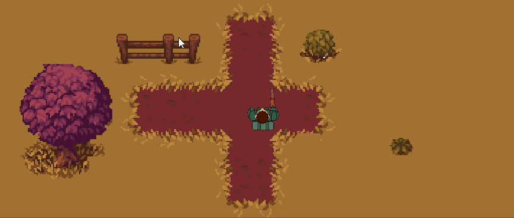

# top-down-shooting-unity

2D game created in Unity from youtube video "TOP DOWN Shooting in Unity!" by Brackeys.

Link to the Video:

https://www.youtube.com/watch?v=LNLVOjbrQj4

Link To his channel:

https://www.youtube.com/@Brackeys

Link To the Soldier asset:
https://rainsong.itch.io/scifi-tabletop-printable-soldiers-top-down

Link To the Bullets asset:
https://bdragon1727.itch.io/free-effect-and-bullet-16x16

This game has several small improvements beyond the tutorial as I tried to make it my own.

# Unity Version
2022.2.9f1

---

# LINK TO CHECK THE MOVEMENT
https://rubenftgd.github.io/top-down-shooting-unity

# CONTROLS
**Keys** - Move UP/Down and Left/Right

**W/S/A/D** - Move UP/Down and Left/Right

**Move Player Aim** - Mouse Control

**Shoot** - Left mouse button

---

**Gameplay**
======

---

# TO FIX WEB GAME DEPLOY
Go to Player setting -> WebGL -> Publish settings -> Compression = disabled. 
